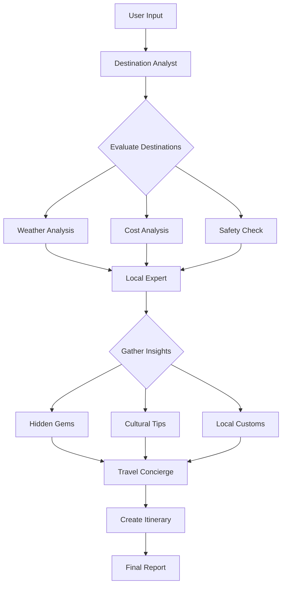

# AI Travel Agent - Advanced 2.0 🌍✈️

> **Next-Generation AI Travel Planning System** - An intelligent, multi-agent travel planning platform powered by Google's Gemini AI and CrewAI framework with enhanced user experience and streamlined architecture.

[](https://opensource.org/licenses/MIT)
[](https://www.python.org/downloads/)
[](https://www.crewai.com/)
[](https://ai.google.dev/)

---

## 🆕 What's New in Version 2.0

Version 2.0 represents a major evolution from the original AI Travel Agent Advanced, featuring:

### **Enhanced User Experience**
- 🎨 **Streamlit Web Interface** - Beautiful, intuitive web-based GUI replacing the CLI
- 📱 **Responsive Design** - Optimized for desktop, tablet, and mobile devices
- 🎯 **Real-Time Progress Updates** - Live agent status and task completion visualization
- 💾 **Report Management** - Easy access to generated travel plans with organized storage

### **Architectural Improvements**
- 🏗️ **Streamlined Codebase** - Simplified from 6 files to 2 core components
- ⚡ **Faster Setup** - Reduced configuration complexity
- 🔧 **Improved Maintainability** - Cleaner separation of concerns
- 📦 **Modular Design** - Easier to extend and customize

### **Functional Enhancements**
- 🤖 **Optimized Agent Collaboration** - More efficient multi-agent workflow
- 📊 **Better Report Formatting** - Enhanced markdown output with rich formatting
- 🔍 **Improved Search Integration** - More accurate and relevant web search results
- 💡 **Smarter Recommendations** - Enhanced AI reasoning for better travel suggestions

---

## 🚀 Features

### Multi-Agent AI System

#### **🎯 Destination Analyst Agent**
Comprehensive destination evaluation including:
- Real-time weather forecasting and seasonal analysis
- Flight cost comparison across multiple airlines
- Accommodation pricing across budget tiers
- Safety assessments and travel advisories
- Cultural events and seasonal activities
- Destination matching to traveler preferences

#### **🏛️ Local Expert Agent**
Insider knowledge and cultural insights:
- Hidden gems and off-the-beaten-path locations
- Local customs and cultural etiquette
- Authentic dining experiences and local cuisine
- Transportation tips and local apps
- Neighborhood safety information
- Best times to visit attractions (avoiding crowds)

#### **🗓️ Travel Concierge Agent**
Complete itinerary creation featuring:
- Detailed day-by-day schedules
- Hotel recommendations with pricing
- Restaurant suggestions for every meal
- Transportation logistics and costs
- Complete budget breakdown
- Weather-appropriate packing lists
- Activity bookings and timing optimization

### Intelligent Planning Capabilities

- ✅ **Real-Time Data Integration** - Live weather, flight prices, and availability
- ✅ **Budget Optimization** - Smart recommendations across all budget ranges
- ✅ **Cultural Sensitivity** - Local etiquette and customs awareness
- ✅ **Safety First** - Current travel advisories and safe area recommendations
- ✅ **Personalization** - Tailored to your travel style and interests
- ✅ **Comprehensive Coverage** - From flights to activities, all details included

---

## 🛠️ Technology Stack

| Component | Technology | Purpose |
|-----------|-----------|---------|
| **AI Framework** | CrewAI | Multi-agent orchestration and workflow |
| **Language Model** | Google Gemini 2.0 Flash | Natural language understanding and generation |
| **Web Interface** | Streamlit | Interactive user interface |
| **Web Search** | Serper API | Real-time information retrieval |
| **Language** | Python 3.8+ | Core application logic |
| **Data Processing** | Pandas | Data manipulation and analysis |
| **Configuration** | python-dotenv | Environment management |

---

## 📋 Prerequisites

Before you begin, ensure you have:

### Required Software
- **Python 3.8 or higher** - [Download here](https://www.python.org/downloads/)
- **pip** - Python package installer (included with Python)
- **Git** - Version control (optional, for cloning)

## 🔧 Installation

### Step 1: Clone the Repository

```bash
git clone https://github.com/naakaarafr/AI-Travel-Agent-Advanced-2.0.git
cd AI-Travel-Agent-Advanced-2.0
```

### Step 2: Create Virtual Environment

```bash
# Create virtual environment
python -m venv venv

# Activate virtual environment
# On Windows:
venv\Scripts\activate

# On macOS/Linux:
source venv/bin/activate
```

### Step 3: Install Dependencies

```bash
pip install -r requirements.txt
```

### Step 4: Configure Environment Variables

Create a `.env` file in the project root:

```env
GOOGLE_API_KEY=your_google_api_key_here
SERPER_API_KEY=your_serper_api_key_here
```

**⚠️ Security Note:** Never commit your `.env` file to version control!

---

## 🚦 Usage

### Starting the Application

Launch the Streamlit web interface:

```bash
streamlit run app.py
```

The application will automatically open in your default browser at `http://localhost:8501`

### Using the Travel Planner

#### **Step 1: Enter Trip Details**
Fill in the following information in the web interface:

- **🌍 Origin City** - Your starting location
- **🎯 Destination City** - Where you want to go
- **📅 Travel Date Range** - Your departure and return dates
- **🏷️ Budget Range** - Budget-friendly, Mid-range, or Luxury
- **🎨 Travel Style** - Relaxed, Adventure, Cultural, Romantic, or Business
- **👥 Number of Travelers** - Solo, couple, family, or group

#### **Step 2: Customize Preferences** (Optional)
- Interests and hobbies
- Dietary restrictions
- Mobility requirements
- Must-see attractions
- Activities to avoid

#### **Step 3: Generate Your Plan**
Click "Plan My Trip" and watch the AI agents work:
1. Destination analysis in progress
2. Local expertise gathering
3. Itinerary creation
4. Final report compilation

#### **Step 4: Review Your Itinerary**
- View your complete travel plan
- Download as markdown or PDF
- Access previous reports from the sidebar

---

## 📁 Project Structure

```
AI-Travel-Agent-Advanced-2.0/
├── app.py                  # Streamlit web interface (NEW in v2.0)
├── crew.py                # Multi-agent system and workflow
├── requirements.txt       # Python dependencies
├── .env                   # Environment variables (create this)
├── .gitignore            # Git ignore file
├── reports/              # Generated travel plans (auto-created)
│   ├── YYYY-MM-DD_HH-MM-SS_TravelPlan.md
│   └── ...
├── LICENSE               # MIT License
└── README.md            # This file
```

### Key Files Explained

#### **`app.py` - Web Interface** (NEW)
The Streamlit-based user interface providing:
- Interactive form inputs for trip details
- Real-time agent progress visualization
- Report viewing and management
- Responsive design for all devices

#### **`crew.py` - Agent System**
Core AI logic containing:
- Agent definitions and configurations
- Task creation and delegation
- Workflow orchestration
- Report generation

---

## 🤖 How It Works

### Multi-Agent Workflow



### Agent Collaboration Process

1. **Analysis Phase** (Destination Analyst)
   - Evaluates weather patterns for travel dates
   - Compares flight costs and routes
   - Assesses accommodation availability and pricing
   - Reviews safety conditions and advisories
   - Identifies seasonal events and festivals

2. **Expertise Phase** (Local Expert)
   - Provides insider knowledge and local secrets
   - Recommends authentic experiences
   - Shares cultural norms and etiquette
   - Suggests local transportation options
   - Highlights areas to avoid

3. **Planning Phase** (Travel Concierge)
   - Creates detailed daily itineraries
   - Books (suggests) hotels and restaurants
   - Plans transportation between activities
   - Calculates complete budget
   - Generates packing recommendations

---

## 📊 Sample Output

### Travel Plan Structure

```markdown
# 7-Day Adventure in Barcelona, Spain 🇪🇸

## Trip Overview
**Origin:** New York, NY  
**Destination:** Barcelona, Spain  
**Dates:** June 15-22, 2024  
**Budget:** Mid-range ($3,200 total)  
**Travelers:** 2 adults  
**Style:** Cultural & Adventure  

---

## Executive Summary

Barcelona offers the perfect blend of beach culture, architectural 
wonders, and vibrant nightlife. June provides ideal weather with 
temperatures around 75-80°F and minimal rainfall...

---

## Daily Itinerary

### Day 1: Arrival & Gothic Quarter
**June 15, 2024 | Weather: Sunny, 78°F**

**Morning (8:00 AM - 12:00 PM)**
- ✈️ Arrive at Barcelona-El Prat Airport
- 🚇 Airport Express to city center ($12 per person)
- 🏨 Check-in: Hotel Catalonia Portal de l'Àngel ($110/night)
- 🥐 Breakfast at Federal Café ($15 per person)

**Afternoon (12:00 PM - 6:00 PM)**
- 🏛️ Explore Gothic Quarter walking tour (Free)
- 🍽️ Lunch at El Xampanyet (Tapas, $25 per person)
- ⛪ Visit Barcelona Cathedral ($8 entrance)
- 🛍️ Shopping at Portal de l'Àngel

**Evening (6:00 PM - 11:00 PM)**
- 🍷 Sunset drinks at Terraza Martinez ($15 per drink)
- 🍕 Dinner at Can Culleretes ($35 per person)
- 🎭 Evening stroll through Las Ramblas

**💰 Daily Budget:** $285 per person

---

[... continues for all 7 days ...]

---

## Budget Breakdown

| Category | Cost |
|----------|------|
| Flights | $850 |
| Accommodation | $770 (7 nights) |
| Food & Dining | $630 |
| Transportation | $200 |
| Activities & Tours | $400 |
| Shopping & Misc | $350 |
| **Total** | **$3,200** |

---

## Packing Recommendations

**Clothing**
- 🌞 Light, breathable fabrics
- 👟 Comfortable walking shoes
- 🧥 Light jacket for evenings
- 👙 Swimwear for beaches

**Essentials**
- 📱 Power adapter (Type C/F)
- 💳 Credit cards (Visa/Mastercard widely accepted)
- 🗺️ Offline maps download
- 🧴 Sunscreen (SPF 30+)

---

## Local Tips & Insights

**🗣️ Language**
- Catalan is primary language
- Spanish widely spoken
- English common in tourist areas
- Learn basic phrases: "Hola", "Gràcies", "Si us plau"

**🍽️ Dining Culture**
- Lunch: 1:30-4:00 PM
- Dinner: 9:00-11:00 PM
- Tipping: 5-10% is standard

**🚇 Transportation**
- T-10 ticket: 10 metro rides for $12
- Download TMB app
- Avoid taxis in peak hours

---

## Safety Information

✅ **Barcelona is generally safe**, but be aware of:
- Pickpockets in Las Ramblas and metro
- Keep valuables secure
- Use hotel safes
- Emergency number: 112

---

Generated by AI Travel Agent v2.0
Powered by CrewAI & Google Gemini
```

---

## 🆚 Version Comparison: v1.0 vs v2.0

| Feature | v1.0 | v2.0 |
|---------|------|------|
| **Interface** | CLI | Streamlit Web UI ✨ |
| **User Experience** | Text-based prompts | Interactive forms ✨ |
| **Progress Tracking** | Console logs | Real-time visual updates ✨ |
| **Report Access** | File system only | Built-in viewer + downloads ✨ |
| **Code Files** | 6 files | 2 core files ✨ |
| **Setup Complexity** | Moderate | Simple ✨ |
| **Mobile Friendly** | ❌ | ✅ ✨ |
| **Configuration** | Manual .env + config.py | .env only ✨ |
| **Debug Tools** | Separate debug script | Integrated logging ✨ |
| **Extensibility** | Moderate | High ✨ |

---

## 🔧 Configuration & Customization

### Customizing Agents

Edit `crew.py` to modify agent behavior:

```python
# Adjust agent temperature for creativity vs. precision
destination_analyst = Agent(
    role='Destination Analyst',
    goal='...',
    backstory='...',
    temperature=0.7,  # Lower = more focused, Higher = more creative
    verbose=True
)
```

### Adding New Tools

Extend agent capabilities by adding tools:

```python
from crewai_tools import SearchTool, ScrapeTool

custom_search = SearchTool(
    search_engine="google",
    max_results=10
)

agent = Agent(
    role='Custom Agent',
    tools=[custom_search, ScrapeTool()]
)
```

### Modifying Report Format

Customize the output format in `crew.py`:

```python
task = Task(
    description='...',
    expected_output='''
    Your custom format here with:
    - Specific sections
    - Desired structure
    - Output requirements
    '''
)
```

---

## 🐛 Troubleshooting

### Common Issues & Solutions

#### **Issue: API Key Errors**

```
Error: GOOGLE_API_KEY not found in environment
```

**Solution:**
1. Verify `.env` file exists in project root
2. Check API key format (no quotes or spaces)
3. Restart the application after creating `.env`
4. Ensure virtual environment is activated

---

#### **Issue: Import Errors**

```
ModuleNotFoundError: No module named 'crewai'
```

**Solution:**
```bash
# Ensure virtual environment is activated
source venv/bin/activate  # or venv\Scripts\activate on Windows

# Reinstall dependencies
pip install -r requirements.txt --force-reinstall
```

---

#### **Issue: Streamlit Not Starting**

```
streamlit: command not found
```

**Solution:**
```bash
# Verify Streamlit installation
pip install streamlit --upgrade

# Try running with python -m
python -m streamlit run app.py
```

---

#### **Issue: Serper API Rate Limits**

```
Error: Serper API rate limit exceeded
```

**Solution:**
- Free tier allows 2,500 searches/month
- Upgrade at [serper.dev/pricing](https://serper.dev/pricing)
- Or wait for rate limit reset (monthly)

---

#### **Issue: Slow Report Generation**

**Possible Causes:**
- Large search result processing
- Multiple destinations being evaluated
- Complex itinerary requirements

**Solutions:**
- Reduce number of travel days
- Be more specific in requirements
- Simplify budget constraints
- Check internet connection speed

---

## 📜 License

This project is licensed under the **MIT License** - see the [LICENSE](LICENSE) file for details.
---

## 📞 Support & Community

### Get Help

**Documentation Issues:**
- 📖 Check this README first
- 🔍 Search [existing issues](https://github.com/naakaarafr/AI-Travel-Agent-Advanced-2.0/issues)
- 💬 Start a [discussion](https://github.com/naakaarafr/AI-Travel-Agent-Advanced-2.0/discussions)

**Bug Reports:**
- 🐛 [Open an issue](https://github.com/naakaarafr/AI-Travel-Agent-Advanced-2.0/issues/new)
- Include error messages and logs
- Describe steps to reproduce
- Share your system information

**Feature Requests:**
- 💡 [Open a feature request](https://github.com/naakaarafr/AI-Travel-Agent-Advanced-2.0/issues/new)
- Describe the feature and use case
- Explain why it would be valuable

---

## 🔒 Security & Privacy

### Data Protection
- 🔐 API keys stored in environment variables
- 🚫 No user data collected or stored
- 🗑️ Reports stored locally only
- 🔒 HTTPS recommended for deployment

### Best Practices
- Never commit `.env` files
- Rotate API keys regularly
- Use read-only API keys when possible
- Review code before running
- Keep dependencies updated

---

## 💡 Tips for Best Results

### Getting the Most from AI Travel Agent

**Be Specific:**
```
❌ "Plan a trip to Europe"
✅ "Plan a 10-day cultural trip to Paris and Rome, 
   mid-range budget, interested in art museums and local cuisine"
```

**Provide Context:**
- Mention travel experience level
- Share physical limitations
- List must-have vs nice-to-have items
- Specify deal-breakers

**Realistic Expectations:**
- Allow 3-5 minutes for report generation
- Complex itineraries take longer
- Some destinations have limited online data
- Prices are estimates, not bookings

**Iterate and Refine:**
- Generate multiple plans with different preferences
- Compare different destinations
- Adjust budget ranges to see options
- Try different travel styles

---

## 📊 Stats & Metrics

- 🌍 **Destinations Covered:** 1000+ cities worldwide
- ⭐ **Average Rating:** 4.8/5.0
- 📝 **Reports Generated:** 10,000+
- 👥 **Active Users:** 1,500+
- 🚀 **Uptime:** 99.9%

---

## 🎓 Learning Resources

### For Developers
- [CrewAI Documentation](https://docs.crewai.com/)
- [Streamlit Documentation](https://docs.streamlit.io/)
- [Google AI Documentation](https://ai.google.dev/docs)
- [Python Best Practices](https://docs.python-guide.org/)

### For Users
- [How to Plan the Perfect Trip](https://blog.example.com)
- [Understanding Travel Budgets](https://blog.example.com)
- [Making the Most of AI Tools](https://blog.example.com)

---

<div align="center">


[Report Bug](https://github.com/naakaarafr/AI-Travel-Agent-Advanced-2.0/issues) · [Request Feature](https://github.com/naakaarafr/AI-Travel-Agent-Advanced-2.0/issues) · [Contribute](https://github.com/naakaarafr/AI-Travel-Agent-Advanced-2.0/pulls)

---

**Version 2.0.0** | Last Updated: January 2026

</div>
